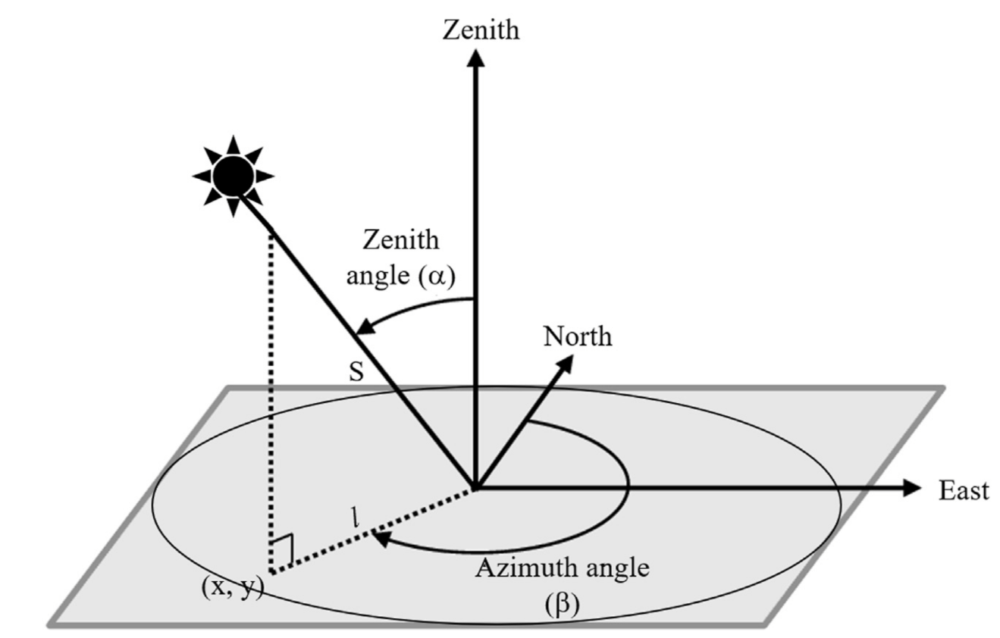

# [Solar Positioning](@id solar-positioning-algorithms)

All solar position algorithms available in `SolarPosition.jl`  return solar zenith,
elevation, and azimuth angles. Algorithms that include an atmospheric refraction model
also return “apparent” (refraction-corrected) values by default. This behavior can be
modified by specifying a different refraction algorithm or passing [`NoRefraction`](@ref NoRefraction)
no refraction correction is desired. See the [Refraction Correction](@ref refraction-correction)
page for more details on refraction models.


Figure 1: Visualization of solar position angles: azimuth and zenith. Image source:
[Haputhanthri et al.](@cite haputhanthri2021solar).

The solar azimuth angle is typically measured clockwise from true north. The solar
zenith angle is the angle between the sun and the vertical direction directly overhead.
The solar elevation angle is the complement of the zenith angle (i.e., elevation = 90°- zenith).

Typically solar position algorithms can take the following set of inputs:

- Observer location: latitude, longitude, and altitude
- Date and time: in UTC or local time with timezone information
- Optional atmospheric parameters: pressure and temperature (for refraction correction)

## Example: Solar Path Plotting

Solar positions can be calculated using [`solar_position`](@ref solar_position)
and the in-place version [`solar_position!`](@ref solar_position!) functions.

As an example, we plot the longest day of the year solar path for an observer located
at the Van Gogh museum in Amsterdam (52.35888°N, 4.88185°E) on June 21, 2023:

```@example

using SolarPosition, Dates, CairoMakie

# define observer location (latitude, longitude, altitude in meters)
obs = Observer(52.35888, 4.88185, 100.0)  # Van Gogh Museum, Amsterdam
times = collect(DateTime(2023, 6, 21, 0):Minute(5):DateTime(2023, 6, 21, 23, 55));
positions = solar_position(obs, times, PSA(), HUGHES());

# plot elevation and azimuth over the day
fig = Figure(backgroundcolor = :transparent, textcolor= "#f5ab35", size = (800, 400))
ax1 = Axis(fig[1, 1], xlabel = "Time (hours)", ylabel = "Elevation (degrees)",
    title = "Solar Elevation on June 21, 2023 - Amsterdam", backgroundcolor = :transparent,
    xticks = 0:3:24)
ax2 = Axis(fig[1, 2], xlabel = "Time (hours)", ylabel = "Azimuth (degrees)",
    title = "Solar Azimuth on June 21, 2023 - Amsterdam", backgroundcolor = :transparent,
    xticks = 0:3:24)
times_hours = [Dates.hour(t) + Dates.minute(t)/60 for t in times]
lines!(ax1, times_hours, positions.elevation, color = "#f5ab35")
lines!(ax2, times_hours, positions.azimuth, color = "#f5ab35")
fig
```

## Available Algorithms

The following solar position algorithms are currently implemented in SolarPosition.jl:

| Algorithm                                             | Reference       | Accuracy | Default Refraction                               | Status |
| ----------------------------------------------------- | --------------- | -------- | ------------------------------------------------ | ------ |
| [`PSA`](@ref SolarPosition.Positioning.PSA)           | [BALL01](@cite) | ±0.0083° | None                                             | ✅     |
| [`NOAA`](@ref SolarPosition.Positioning.NOAA)         | [NOAA](@cite)   | ±0.0167° | [`HUGHES`](@ref SolarPosition.Refraction.HUGHES) | ✅     |
| [`Walraven`](@ref SolarPosition.Positioning.Walraven) | [Wal78](@cite)  | ±0.0100° | None                                             | ✅     |
| [`USNO`](@ref SolarPosition.Positioning.USNO)         | [USNO](@cite)   | ±0.0500° | None                                             | ✅     |
| [`SPA`](@ref SolarPosition.Positioning.SPA)           | [RA04](@cite)   | ±0.0003° | Built-in                                         | ✅     |
| [`Iqbal`](@ref SolarPosition.Positioning.Iqbal)       | [Iqb83](@cite)  | ±0.0100° | None                                             | ✅     |
| [`Michalsky`](@ref SolarPosition.Positioning.Michalsky) | [Mic88](@cite) | ±0.0100° | [`MICHALSKY`](@ref SolarPosition.Refraction.MICHALSKY)         | ✅     |
| [`SG2`](@ref SolarPosition.Positioning.SG2)           | [BW12](@cite)   | ±0.0030° | [`SG2Refraction`](@ref SolarPosition.Refraction.SG2Refraction) | ✅     |

## [PSA](@id psa-algorithm)

The PSA (Plataforma Solar de Almería) algorithm is the default high-accuracy solar
position algorithm.

The algorithm was originally published by [BALL01](@cite) and was later updated by
[BMB20](@cite) with new coefficients for improved accuracy.

```@docs
SolarPosition.Positioning.PSA
```

## [NOAA](@id noaa-algorithm)

The NOAA (National Oceanic and Atmospheric Administration) algorithm provides an
alternative implementation based on [NOAA](@cite).

```@docs
SolarPosition.Positioning.NOAA
```

## [Walraven](@id walraven-algorithm)

The Walraven algorithm is a solar position algorithm published in 1978 with stated
accuracy of ±0.0100°.

The algorithm was originally published by [Wal78](@cite) with corrections from the
1979 Erratum [Wal79](@cite) and azimuth quadrant correction from [Spe89](@cite).

```@docs
SolarPosition.Positioning.Walraven
```

## [USNO](@id usno-algorithm)

The USNO (U.S. Naval Observatory) algorithm provides solar position calculations based
on formulas from the USNO's Astronomical Applications Department.

The algorithm offers two options for calculating Greenwich mean sidereal time, providing
flexibility for different accuracy requirements.

```@docs
SolarPosition.Positioning.USNO
```

## [SPA](@id spa-algorithm)

The SPA (Solar Position Algorithm) is the highest-accuracy algorithm available in this
package, with uncertainty of ±0.0003° for years between -2000 and 6000.

The algorithm was published by the National Renewable Energy Laboratory (NREL) in
[RA04](@cite) and implements a complete heliocentric, geocentric, and topocentric solar
position calculation with periodic terms for Earth heliocentric longitude and latitude.

```@docs
SolarPosition.Positioning.SPA
```

## [Iqbal](@id iqbal-algorithm)

The Iqbal algorithm is a fast, low-complexity method that derives the solar declination
and equation of time from a truncated Fourier series in the day angle.

The formulation was compiled by [Iqb83](@cite) and builds on the Fourier-series
representation of [Spe71](@cite).

```@docs
SolarPosition.Positioning.Iqbal
```

## [Michalsky](@id michalsky-algorithm)

The Michalsky algorithm implements the Astronomical Almanac's approximate solar position
algorithm, with a stated accuracy of ±0.01° between 1950 and 2050. It exposes options for
the azimuth-quadrant correction and the Julian date formulation.

The algorithm was published by [Mic88](@cite); the azimuth correction that makes it valid
for all latitudes is from [Spe89](@cite).

```@docs
SolarPosition.Positioning.Michalsky
```

## [SG2](@id sg2-algorithm)

The SG2 (Second Generation) algorithm is optimized for fast and accurate computation over
multi-decadal periods, with a stated accuracy of ±0.003° between 1980 and 2030. Dates
outside this range raise an `ArgumentError`.

The algorithm was published by [BW12](@cite).

```@docs
SolarPosition.Positioning.SG2
```
