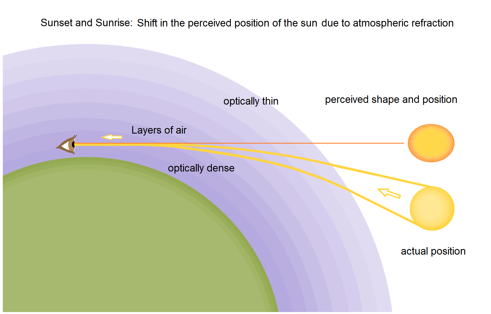

# [Refraction Correction](@id refraction-correction)

Atmospheric refraction causes the apparent position of the sun to differ from its true
geometric position. This effect is most pronounced near the horizon and can be corrected
using various atmospheric models.



`SolarPosition.jl` includes several refraction correction algorithms. Below is a summary
of the available algorithms:

| Algorithm                                              | Reference      | Atmospheric Parameters | Status |
| ------------------------------------------------------ | -------------- | ---------------------- | ------ |
| [`HUGHES`](@ref SolarPosition.Refraction.HUGHES)       | [Hug85](@cite) | Pressure, Temperature  | ✅     |
| [`ARCHER`](@ref SolarPosition.Refraction.ARCHER)       | [Arc80](@cite) | None                   | ✅     |
| [`BENNETT`](@ref SolarPosition.Refraction.BENNETT)     | [Ben82](@cite) | Pressure, Temperature  | ✅     |
| [`MICHALSKY`](@ref SolarPosition.Refraction.MICHALSKY) | [Mic88](@cite) | None                   | ✅     |
| [`SG2`](@ref SolarPosition.Refraction.SG2)             | [BW12](@cite)  | Pressure, Temperature  | ✅     |
| [`SPARefraction`](@ref SolarPosition.Refraction.SPARefraction)             | [RA04](@cite)  | Pressure, Temperature  | ✅     |

To calculate refraction, we can use the [`refraction`](@ref SolarPosition.Refraction.refraction) function:

```@docs
SolarPosition.Refraction.refraction
```

This function is typically used internally by the [`solar_position`](@ref SolarPosition.solar_position) function when a
refraction algorithm is specified, but is also a publicly available method.

!!! info
    When using a refraction algorithm like [`HUGHES`](@ref SolarPosition.Refraction.HUGHES)`()`,
    the [`solar_position`](@ref SolarPosition.Positioning.solar_position) function returns an
    [`ApparentSolPos`](@ref SolarPosition.Positioning.ApparentSolPos) struct containing
    both true and apparent angles.

```@docs
SolarPosition.Refraction.NoRefraction
```

!!! info
    When using [`NoRefraction`](@ref SolarPosition.Refraction.NoRefraction)`()`
    (the default), the [`solar_position`](@ref SolarPosition.Positioning.solar_position)
    function returns a [`SolPos`](@ref SolarPosition.Positioning.SolPos) struct
    containing only the true geometric angles (azimuth, elevation, zenith). In this
    case, no refraction correction is applied.

## Comparison of Refraction Models

Several different refraction models have been proposed in the literature. `SolarPosition.jl`
only implements a subset of them but PRs are always welcome! To compare the different
refraction models, the refraction angle is calculated in the range -1 to 90 degree solar
elevation in steps of 0.1 degrees.

```@example refraction-comparison
using SolarPosition
using CairoMakie

# Define models and elevation range
models = [("Archer", SolarPosition.Refraction.ARCHER()), ("Bennett", SolarPosition.Refraction.BENNETT()),
          ("Hughes", SolarPosition.Refraction.HUGHES()), ("Michalsky", SolarPosition.Refraction.MICHALSKY()),
          ("SG2", SolarPosition.Refraction.SG2()), ("SPA", SolarPosition.Refraction.SPARefraction())]
elevation = -1.5:0.1:90.0

# Create figure with two subplots
fig = Figure(size = (800, 400), backgroundcolor = :transparent, textcolor = "#f5ab35")
ax1 = Axis(fig[1, 1], xlabel = "True elevation [degrees]",
    ylabel = "Refraction correction [degrees]", title = "Near Horizon",
    backgroundcolor = :transparent, xticks = -1:1:4)
ax2 = Axis(fig[1, 2], xlabel = "True elevation [degrees]",
    ylabel = "Refraction correction [degrees]", title = "Full Range (Log Scale)", yscale = log10, backgroundcolor = :transparent)

# Plot refraction for each model
for (name, model) in models
    refr = [SolarPosition.Refraction.refraction(model, e) for e in elevation]
    lines!(ax1, elevation, refr, label = name)
    mask = refr .> 0
    lines!(ax2, elevation[mask], refr[mask])
end

xlims!(ax1, -1.5, 4); ylims!(ax1, 0, 1.0)
xlims!(ax2, -1.5, 90); ylims!(ax2, 1e-3, 1.0)

Legend(fig[0, :], ax1, orientation = :horizontal, framevisible = false,
    tellwidth = false, tellheight = true, nbanks = 1)
fig
```

A comparison of the refraction models is visualized above. The plot on the left shows
refraction for solar elevation angles near sunrise/sunset, where refraction is most
significant. The plot on the right shows the refraction angles for the entire range
of solar elevation angles. Note that for the right plot, the y-axis is a log scale,
which emphasises the difference between the models.

## [Hughes](@id hughes-refraction)

The Hughes refraction model accounts for atmospheric pressure and temperature effects.

This model was developed by [Hug85](@cite) and is used in the SUNAEP software [Zim81](@cite).
It's also the basis for the refraction correction in NOAA's solar position calculator (using fixed
pressure of 101325 Pa and temperature of 10°C).

```@docs
SolarPosition.Refraction.HUGHES
```

## [Archer](@id archer-refraction)

The Archer refraction model is a cosine-based correction that does not require atmospheric parameters.

This simplified model from [Arc80](@cite) computes refraction based on the zenith angle using
trigonometric relationships. It's useful when atmospheric data is not available.

```@docs
SolarPosition.Refraction.ARCHER
```

## [Bennett](@id bennett-refraction)

The Bennett refraction model is widely used in marine navigation and accounts for atmospheric conditions.

Developed by [Ben82](@cite), this model provides accurate refraction corrections with adjustments
for atmospheric pressure and temperature. It's particularly effective for low elevation angles.

```@docs
SolarPosition.Refraction.BENNETT
```

## [Michalsky](@id michalsky-refraction)

The Michalsky refraction model uses a rational polynomial approximation.

From [Mic88](@cite), this algorithm is part of the Astronomical Almanac's method for approximate
solar position calculations. It includes special handling for very low elevation angles.

```@docs
SolarPosition.Refraction.MICHALSKY
```

## [SG2](@id sg2-refraction)

The SG2 (Second Generation) refraction algorithm is optimized for fast computation over multi-decadal periods.

Developed by [BW12](@cite), this algorithm uses a two-regime approach with different formulas
for elevations above and below a threshold. It accounts for atmospheric pressure and temperature.

```@docs
SolarPosition.Refraction.SG2
```

## [SPARefraction](@id spa-refraction)

The SPARefraction (Solar Position Algorithm) refraction model is part of NREL's high-accuracy solar position algorithm.

From [RA04](@cite), this is the refraction correction used in NREL's SPA algorithm, which is
accurate to ±0.0003° over the years -2000 to 6000. It includes a configurable refraction limit
for below-horizon calculations.

```@docs
SolarPosition.Refraction.SPARefraction
```
